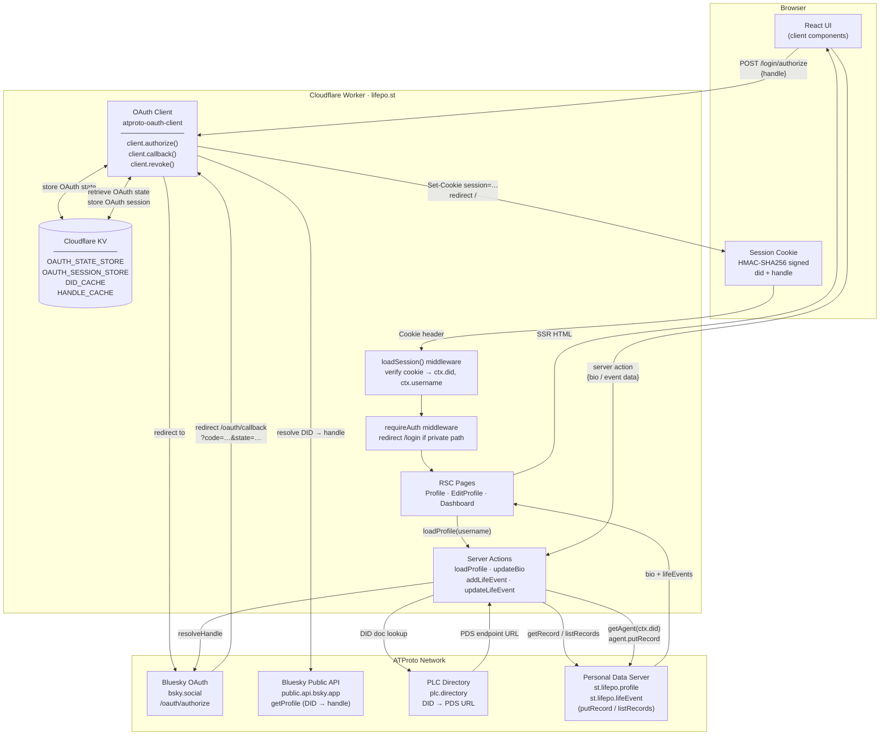

# RedwoodSDK Minimal Starter

This is the starter project for RedwoodSDK. It's a template designed to get you up and running as quickly as possible.

Create your new project:

```shell
npx create-rwsdk my-project-name
cd my-project-name
npm install
```

## Running the dev server

```shell
npm run dev
```

Point your browser to the URL displayed in the terminal (e.g. `http://localhost:5173/`). You should see a "Hello World" message in your browser.

## Further Reading

- [RedwoodSDK Documentation](https://docs.rwsdk.com/)
- [Cloudflare Workers Documentation](https://developers.cloudflare.com/workers)

---

## Architecture & State Flow



### Flow summary

| Flow | Path |
|---|---|
| **Login** | Browser → `POST /login/authorize` → OAuth client → Bluesky OAuth → `/oauth/callback` → signed session cookie |
| **Every request** | Cookie → `loadSession()` verifies HMAC → populates `ctx.did` + `ctx.username` → `requireAuth` gates private routes |
| **Profile read** | `loadProfile()` → resolve handle → PLC directory → PDS `listRecords` → SSR into HTML |
| **Profile write** | Client fires server action → `agent.putRecord` → PDS stores Lexicon record |
| **KV** | OAuth state & sessions survive the authorize→callback redirect; DID/handle caches reduce repeated lookups |
